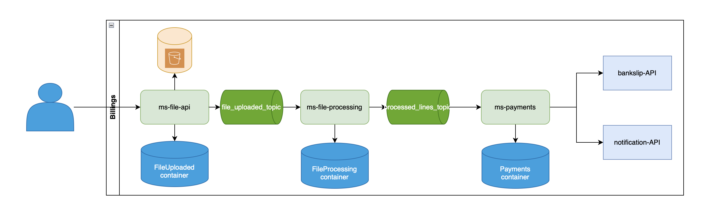

# 🚀 Desafio Billing NestJS

Este projeto simula o processamento de arquivos csv para geração de boletos e envio das cobranças. O projeto foi arquitetado considerando três microsserviços para lidar com o upload (file-api) e processamento do arquivo (file-processing) e geração e envio dos boletos (payments).
 
 <sub>📝 Ps:. O sistema foi construído em um único serviço e separado em módulos para facilitar a implementação.<sub>

### ↔️ Diagrama de interface entre serviços


**Acesse aqui o System Desing aqui:** [draw.io](https://app.diagrams.net/#G1gcWv834mgndpiX_FCwXBhEVJ6H1smiG-#%7B%22pageId%22%3A%22CjcySUKGoNqSamZx-iUz%22%7D)

### 🔄 Fluxo do Sistema

#### 1️⃣ Upload do arquivo (file-api)
- 📥 Recebe um arquivo CSV via requisição HTTP.
- 💾 Salva o arquivo em um bucket do S3 usando localstack.
- 📥 Publica informações para download do arquivo no Kafka

#### 2️⃣ Processamento do Arquivo (file-processing)

- 📥 Recebe infos para download do CSV via Kafka
- 🔍 Valida os dados linha a linha
- 📝 Salva linhas no banco
- 📤 Publica linhas válidas no Kafka para processamento de pagamento

#### 3️⃣ Processamento do Pagamento (payments)
- 📥 Consome mensagens com cada linha do Kafka
- ✅ Valida os campos do pagamento
- 🎟️ Gera o boleto
- 📩 Envia e-mail
- 🕒 Crons:
   - 🔁 Tenta regerar boletos que falharam
   - 📨 Tenta reenviar e-mails que falharam

## Estrutura do projeto

```sh
📦 billing-system
 ┣ 📂 src
 ┃ ┣ 📂 modules
 ┃ ┃ ┣ 📂 file-api          # Upload do arquivo
 ┃ ┃ ┣ 📂 file-processing   # Processamento do arquivo CSV
 ┃ ┃ ┣ 📂 payments          # Geração de boletos e envio de e-mail
 ┃ ┃ ┣ 📂 shared            # Módulos compartilhados (Kafka, S3, DB)
 ┃ ┣ 📂 database            # Migrations e configurações do banco
 ┣ 📜 docker-compose.yml    # Configuração do ambiente com Docker
 ┣ 📜 README.md             # Este documento!
```

### ⚙️ Melhorias e débitos técnicos

✅ Implementar enpoints para relatórios dos pagamentos processados
✅ Implementar alertas para problemas de reprocessamentos utilizando webhooks (slack, teams)

## 📦 Pré-requisitos
- **Docker e Docker Compose** (https://docs.docker.com/get-docker/)
- **Node.js** (v18+)
- **NestJS CLI**: `npm install -g @nestjs/cli`
- **AWS CLI** (https://docs.aws.amazon.com/cli/latest/userguide/install-cliv2.html)

## 🚀 Como rodar o projeto

### 1. Clone o repositório:
   ```sh
   git clone https://github.com/fstufop/DesafioBillingNestJs.git
   cd DesafioBillingNestJs
   ```

### 2. Instalar dependências
   ```sh
npm install
   ```
### 3. Subir o container:
```sh
docker-compose up -d
```
### 4. Criar o bucket do S3 no local stack:
```sh
chmod +x localstack-init.sh
aws --endpoint-url=http://localhost:4566 s3 mb s3://file-api-bucket
```
### 5. Compilar o projeto
```sh
npm run build
```
### 6. Rodar as migrations
```sh
npm run migration:run
```
### 7. Rodar o projeto
```sh
npm run start:dev
```

### Utilização do sistema
O arquivo pode ser enviado via requisição POST utilizando:
- [Postman](https://www.postman.com)/[Insomina](https://insomnia.rest/download):
```
curl --location 'http://localhost:3000/files/upload' \
--form 'file=@"billing.csv"'
```

- [Swagger](http://localhost:3006/docs#/FileApi)

`http://localhost:3006/docs#/FileApi`
